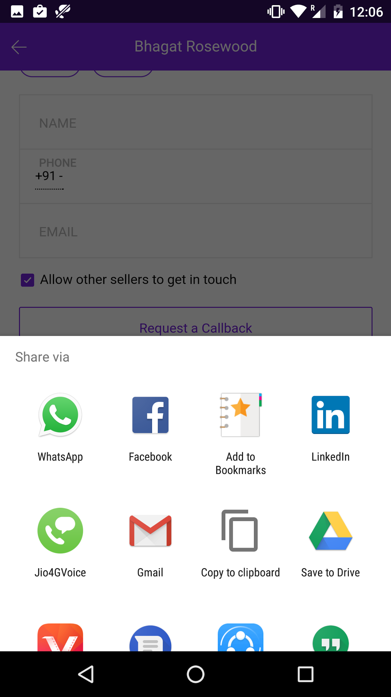
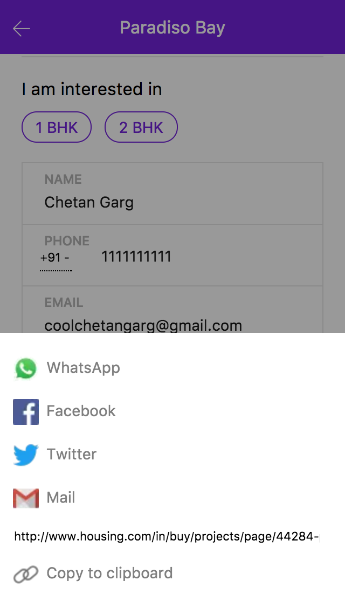

#react-share-button

> A lightweight React Share Button for mobile web with web share api integration, native intent support and fallback.


##Features

1. [Web Share Api](https://developers.google.com/web/updates/2016/10/navigator-share) (on Origin Trials experiment until April 2017)
1. Share Modal Fallback for other browsers 
1. Share via Whatsapp, FB, Twitter, Mail or Copy on Clipboard

## Installation

```
npm install --save react-share-button
```

## Basic Usage

To get web-share API on your origin just [requesting a token for your origin.](https://docs.google.com/forms/d/e/1FAIpQLSfO0_ptFl8r8G0UFhT0xhV17eabG-erUWBDiKSRDTqEZ_9ULQ/viewform_)
You will get an email within 24 hrs with you key, then just add a meta tag
```
<meta http-equiv="origin-trial" content="**insert your token as provided in the the email here**">
```
Know more about [OriginTrials](https://github.com/jpchase/OriginTrials/blob/gh-pages/developer-guide.md) 

**JSX**:
```js
import ShareBtn from 'react-share-button';

<ShareBtn 
  url={url}
  text={text}
  className='ib'
  displayText='Share'
/>
```
**CSS**
```css
@import "react-share-button/dist/ShareBtn"
```

## Options

### &lt;ShareBtn/&gt; Component

prop|default|description
----|-------|-----------
className|''|Custom classnamem, you can style your button with this
url|''|The URL you want to share
text|''|The Text before the URL (E.g. Hey checkout this awesome property!!)
displayText| Share |Any text you wanna write on button like Share Property
onShareBtnClick| () => {} |A callback function when share button is clicked
sharedBy| (medium) => {console.log('shared via ', medium)}|A callback function when user clicks on any share medium from share modal

### Preview
<div style='text-align:center;'>
  <span display="inline-block" margin-right="12"></span>
  <span display="inline-block"></span>
</div>

### Development
```
git clone https://github.com/housinghq/react-share-button
cd react-share-button
npm install
npm run storybook
```

Open an issue before opening a PR. The UI in this package is for moibile only.

###License
MIT @ Loconsolutions
